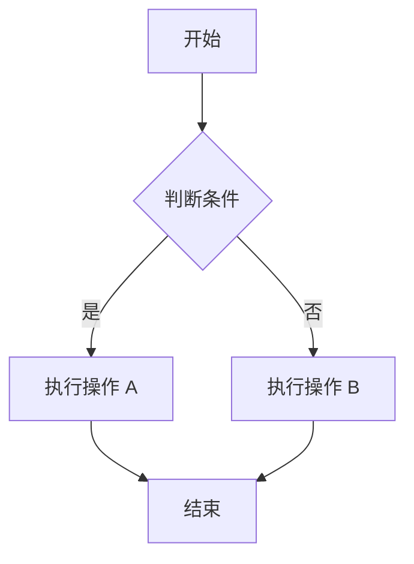
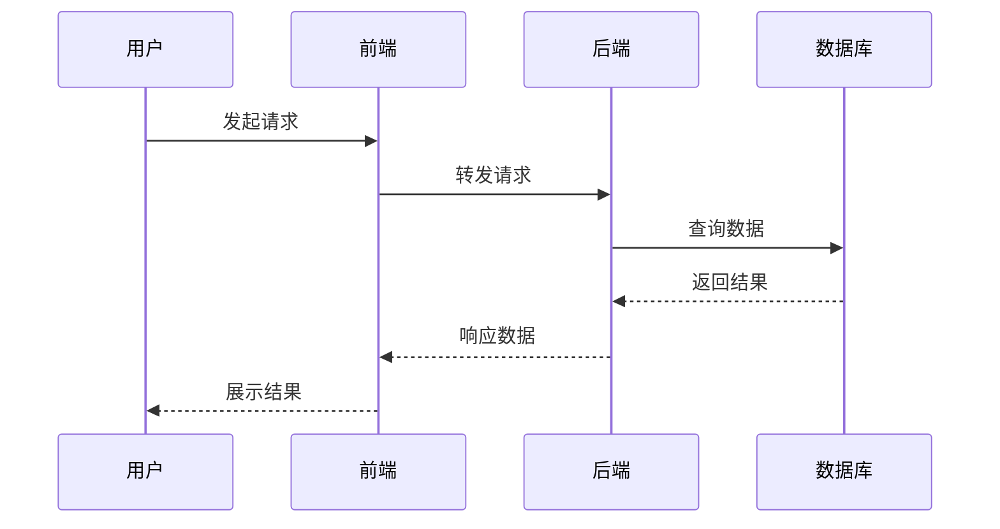
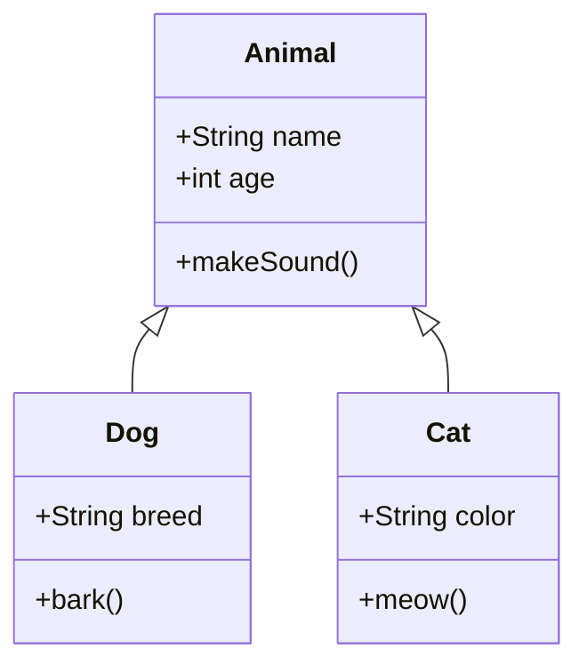
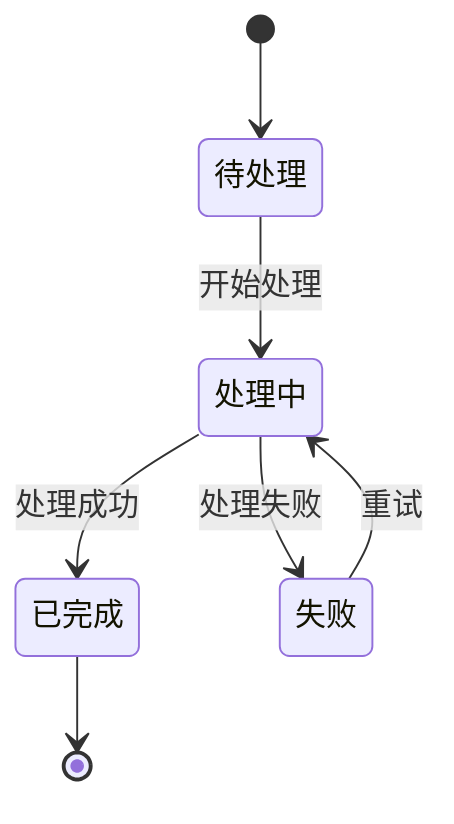
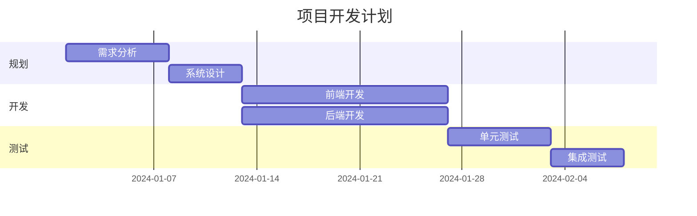
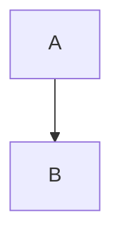

# Mermaid 图表示例

本文演示了如何在 Markdown 文章中使用 Mermaid 图表。只需使用 ` ```mermaid ` 代码块即可。

---

## 1. 流程图 (Flowchart)



---

## 2. 序列图 (Sequence Diagram)



---

## 3. 类图 (Class Diagram)



---

## 4. 状态图 (State Diagram)



---

## 5. 甘特图 (Gantt Chart)



---

## 使用说明

在 Markdown 文件中，使用以下语法即可插入 Mermaid 图表：

````markdown

````

支持的图表类型包括：

- **流程图** (`graph` / `flowchart`)
- **序列图** (`sequenceDiagram`)
- **类图** (`classDiagram`)
- **状态图** (`stateDiagram`)
- **甘特图** (`gantt`)
- **饼图** (`pie`)
- **用户旅程图** (`journey`)
- **思维导图** (`mindmap`)

更多语法请参考 [Mermaid 官方文档](https://mermaid.js.org/intro/)。
