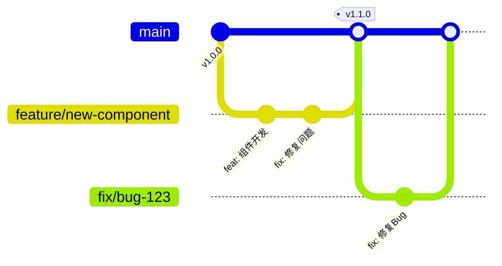

# Git 团队开发规范

本文档定义了项目的 Git 工作流程和提交规范，旨在保持代码库的整洁和可追溯性。

## 分支策略

我们采用简化版 **GitHub Flow** 工作流：



### 分支命名规范

| 分支类型 | 命名格式          | 示例                    | 说明                 |
| -------- | ----------------- | ----------------------- | -------------------- |
| 主分支   | `main`            | `main`                  | 生产就绪代码，受保护 |
| 功能分支 | `feature/<描述>`  | `feature/image-preview` | 新功能开发           |
| 修复分支 | `fix/<描述>`      | `fix/router-encoding`   | Bug 修复             |
| 热修复   | `hotfix/<描述>`   | `hotfix/security-patch` | 紧急线上修复         |
| 重构分支 | `refactor/<描述>` | `refactor/api-layer`    | 代码重构             |

### 分支使用指南

#### 什么时候创建分支？

| 场景                         | 建议                  |
| ---------------------------- | --------------------- |
| 大功能（需要多天、多次提交） | ✅ 必须创建功能分支   |
| 中等功能（1-2个提交）        | ⚡ 可直接在 main 提交 |
| 小修复（改文案、调样式）     | ⚡ 直接在 main 提交   |
| 实验性改动                   | ✅ 创建独立分支       |

#### 分支工作流程

```bash
# 1. 从 main 创建功能分支
git checkout main
git pull origin main
git checkout -b feature/comment-system

# 2. 开发过程中定期提交
git add .
git commit -m "feat(comments): 添加评论数据结构"

# 3. 开发完成后推送
git push origin feature/comment-system

# 4. 创建 Pull Request 并合并

# 5. 合并后删除本地分支
git checkout main
git pull origin main
git branch -d feature/comment-system
```

## Commit 信息规范

我们遵循 [Conventional Commits](https://www.conventionalcommits.org/) 规范。

### 提交格式

```
<type>(<scope>): <subject>

<body>

<footer>
```

**示例：**

```
feat(archive): 添加压缩包预览组件

- 支持 zip/rar/7z 格式
- 添加文件树形结构展示
- 集成下载功能

Closes #123
```

### Type 类型

| 类型       | 说明                     | 示例                      |
| ---------- | ------------------------ | ------------------------- |
| `feat`     | 新功能                   | `feat: 添加图片预览`      |
| `fix`      | Bug 修复                 | `fix: 修复路由刷新白屏`   |
| `docs`     | 文档变更                 | `docs: 更新 README`       |
| `style`    | 代码格式（不影响逻辑）   | `style: 格式化代码`       |
| `refactor` | 重构（不是新功能或修复） | `refactor: 优化组件结构`  |
| `perf`     | 性能优化                 | `perf: 优化图片加载速度`  |
| `test`     | 测试相关                 | `test: 添加单元测试`      |
| `build`    | 构建/依赖变更            | `build: 升级 vite 版本`   |
| `ci`       | CI 配置                  | `ci: 添加 GitHub Actions` |
| `chore`    | 其他杂项                 | `chore: 更新 .gitignore`  |
| `revert`   | 回滚                     | `revert: 回滚 xxx 提交`   |

### Scope 作用域（推荐）

根据项目结构定义的作用域：

| Scope        | 说明     |
| ------------ | -------- |
| `components` | 通用组件 |
| `layout`     | 布局相关 |
| `router`     | 路由相关 |
| `styles`     | 样式相关 |
| `docs`       | 文档内容 |
| `utils`      | 工具函数 |
| `deps`       | 依赖更新 |

**带 scope 的示例：**

```bash
feat(components): 添加 ImageViewer 组件
fix(router): 修复中文路径编码问题
style(layout): 调整侧边栏间距
```

### 使用 Commitizen 提交

项目已配置 Commitizen，推荐使用交互式提交：

```bash
npm run commit
```

## Pull Request 规范

### PR 标题

遵循 Commit 规范格式：

```
feat(comments): 添加段落级评论功能
```

### PR 描述模板

```markdown
## 变更说明

简要描述这个 PR 做了什么

## 变更类型

- [ ] 新功能 (feat)
- [ ] Bug 修复 (fix)
- [ ] 重构 (refactor)
- [ ] 文档 (docs)
- [ ] 其他

## 测试

- [ ] 本地测试通过
- [ ] 新增/更新测试用例

## 截图（如有 UI 变更）
```

### Code Review 要点

- 代码是否符合项目规范
- 逻辑是否正确、清晰
- 是否有潜在的性能问题
- 是否有足够的错误处理
- 命名是否清晰、一致

## Git 配置

### 必要的配置文件

#### `.gitattributes`

```bash
# 统一换行符
* text=auto eol=lf
*.{cmd,[cC][mM][dD]} text eol=crlf
*.{bat,[bB][aA][tT]} text eol=crlf

# 二进制文件
*.png binary
*.jpg binary
*.woff2 binary
```

#### `.gitignore`

确保忽略以下内容：

- `node_modules/`
- `dist/`
- `.env.local`
- IDE 配置文件
- 系统文件（`.DS_Store`, `Thumbs.db`）

### Git Hooks

项目使用 Husky 管理 Git Hooks：

| Hook         | 作用                           |
| ------------ | ------------------------------ |
| `pre-commit` | 运行 lint-staged 检查代码格式  |
| `commit-msg` | 校验 commit 信息格式（需配置） |

## 常用命令速查

```bash
# 查看提交历史
git log --oneline -20

# 查看分支
git branch -a

# 创建并切换分支
git checkout -b feature/xxx

# 合并分支
git merge feature/xxx

# 删除本地分支
git branch -d feature/xxx

# 删除远程分支
git push origin --delete feature/xxx

# 暂存当前改动
git stash

# 恢复暂存
git stash pop

# 修改最后一次提交
git commit --amend

# 交互式变基（整理提交历史）
git rebase -i HEAD~3
```

## 版本发布

### 版本号规范

遵循 [语义化版本](https://semver.org/lang/zh-CN/)：

```
MAJOR.MINOR.PATCH
主版本.次版本.修订号
```

| 场景               | 版本变化          |
| ------------------ | ----------------- |
| 不兼容的 API 变更  | `1.0.0` → `2.0.0` |
| 向后兼容的新功能   | `1.0.0` → `1.1.0` |
| 向后兼容的问题修复 | `1.0.0` → `1.0.1` |

### 发布流程

1. 确保 `main` 分支代码稳定
2. 更新 `CHANGELOG.md`
3. 更新 `package.json` 版本号
4. 创建 Git Tag：`git tag -a v1.2.0 -m "Release v1.2.0"`
5. 推送 Tag：`git push origin v1.2.0`

---

> 📝 **提示**：规范的目的是提升效率和可维护性，而非增加负担。在保证基本规范的前提下，根据实际情况灵活调整。
