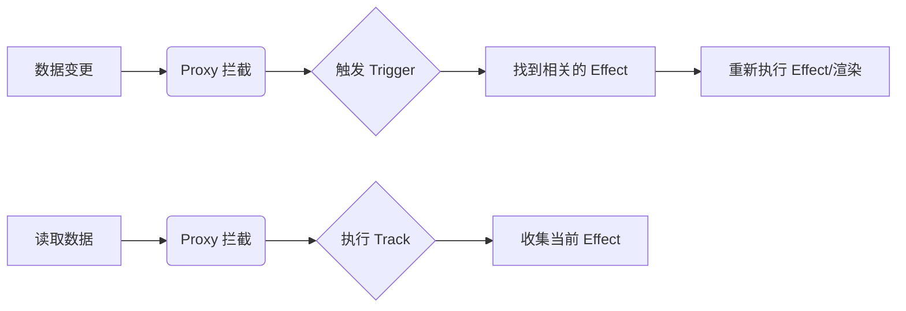

# Vue.js 深度指南：从入门到架构实战

Vue.js 是一套用于构建用户界面的**渐进式框架**。与其它大型框架不同的是，Vue 被设计为可以自底向上逐层应用。本文将深入解析 Vue 3 的核心原理、实战技巧及性能优化。

---

## 1. Vue.js 的核心灵魂：渐进式与 SFC

### 1.1 什么是“渐进式”？
Vue 的设计哲学允许开发者根据需求规模选择不同的集成方式：
1.  **作为库使用**：在 HTML 中通过 `<script>` 标签引入，增强现有页面。
2.  **声明式 UI**：使用模板语法，关注“是什么”而非“怎么做”。
3.  **单文件组件 (SFC)**：通过 `.vue` 文件组织代码，实现高度解耦。
4.  **全功能框架**：集成 Router、Pinia、Vite 等，构建复杂的单页应用 (SPA)。

### 1.2 单文件组件 (SFC) 的威力
Vue 的组件化思想通过 `.vue` 文件体现得淋漓尽致，它将 HTML、CSS 和 JS 封装在一起：

```vue
<template>
  <div class="card">
    <h2>{{ title }}</h2>
    <slot></slot>
  </div>
</template>

<script setup>
defineProps(['title'])
</script>

<style scoped>
.card { border: 1px solid #eee; padding: 1rem; }
</style>
```

---

## 2. 响应式原理深度剖析

Vue 的响应式系统是其最迷人的特性之一。它让状态管理变得直观且自动化。

### 2.1 从 Vue 2 到 Vue 3 的演进
*   **Vue 2 (Object.defineProperty)**：局限于对象属性的拦截，无法检测对象属性的添加/删除或数组索引的变化。
*   **Vue 3 (Proxy)**：基于 ES6 Proxy 实现，可以拦截对象、数组甚至集合类（Map/Set）的所有操作，性能更优。

### 2.2 响应式核心流程
响应式的本质是：**发布-订阅模式**。



### 2.3 手写一个极简响应式 (Vue 3 风格)

```javascript
let activeEffect = null

function watchEffect(effect) {
  activeEffect = effect
  effect() // 执行以触发依赖收集
  activeEffect = null
}

const targetMap = new WeakMap()

function track(target, key) {
  if (!activeEffect) return
  let depsMap = targetMap.get(target)
  if (!depsMap) targetMap.set(target, (depsMap = new Map()))
  let dep = depsMap.get(key)
  if (!dep) depsMap.set(key, (dep = new Set()))
  dep.add(activeEffect)
}

function trigger(target, key) {
  const depsMap = targetMap.get(target)
  if (!depsMap) return
  const dep = depsMap.get(key)
  if (dep) dep.forEach(effect => effect())
}

function reactive(obj) {
  return new Proxy(obj, {
    get(target, key) {
      track(target, key)
      return target[key]
    },
    set(target, key, value) {
      target[key] = value
      trigger(target, key)
      return true
    }
  })
}
```

---

## 3. Composition API：逻辑复用的艺术

Composition API (组合式 API) 是 Vue 3 最重大的变革，它解决了 Options API 在大型项目中代码碎片化的问题。

### 3.1 ref vs reactive
*   **ref**：用于定义基本类型或对象的响应式引用。访问时需要 `.value`（模板中自动解包）。
*   **reactive**：用于定义复杂的响应式对象。无法处理基本类型，且直接解构会失去响应性。

> [!TIP]
> 推荐在大多数情况下使用 `ref`，因为它在类型检查和逻辑追踪上更加清晰。

### 3.2 Composables：自定义组合式函数
通过将逻辑提取到外部函数中，我们可以轻松实现跨组件的代码复用。

```javascript
// useMouse.js
import { ref, onMounted, onUnmounted } from 'vue'

export function useMouse() {
  const x = ref(0)
  const y = ref(0)

  function update(event) {
    x.value = event.pageX
    y.value = event.pageY
  }

  onMounted(() => window.addEventListener('mousemove', update))
  onUnmounted(() => window.removeEventListener('mousemove', update))

  return { x, y }
}
```

---

## 4. Vue 3 性能优化黑科技

Vue 3 之所以比 Vue 2 快得多，主要得益于编译器的智能化。

### 4.1 静态提升 (Static Hoisting)
编译器会将不随状态变化的静态节点提升到渲染函数之外，避免重复创建内存开销。

### 4.2 Patch Flags (静态标记)
在动态节点上添加补丁标记，让 Diff 算法能够直接跳过静态部分，实现精准更新。

```html
<!-- 模板 -->
<div>Hello World</div>
<div :id="id">{{ msg }}</div>

<!-- 编译后的虚拟 DOM (示例) -->
<span>{{ msg }}</span> /* PATCH_FLAG: TEXT */
```

### 4.3 缓存事件处理函数 (Event Handler Caching)
自动缓存事件回调，避免不必要的组件重新渲染。

---

## 5. 工程化生态：Vite & Pinia

### 5.1 Vite：为什么它快得离谱？
传统工具 (Webpack) 需要先打包再启动。Vite 利用浏览器原生支持的 **ES Modules (ESM)**，采取“按需加载”策略，冷启动速度近乎瞬发。

### 5.2 Pinia：现代化状态管理
Pinia 移出了冗余的 Mutations，支持完整的 TypeScript 自动补全，且天然支持模块化。

```javascript
// store/counter.js
import { defineStore } from 'pinia'

export const useCounterStore = defineStore('counter', {
  state: () => ({ count: 0 }),
  actions: {
    increment() {
      this.count++
    }
  }
})
```

---

## 6. 组件通信的艺术：从 Props 到跨层级方案

在构建大型应用时，组件间的通信模式决定了代码的可维护性。

### 6.1 Provide / Inject：摆脱 Prop Drilling
当需要深层传递数据时，`Provide/Inject` 提供了依赖注入能力。

```javascript
// 父组件 parent.vue
provide('theme', 'dark')

// 子组件 child.vue
const theme = inject('theme', 'light') // 支持设置默认值
```

### 6.2 外部状态管理：Pinia 与全局单例
虽然 Composition API 可以通过导出单例实现状态共享，但 Pinia 提供了更好的开发者工具支持、SSR 兼容性和插件扩展。

---

## 7. 进阶特性：自定义能力

### 7.1 自定义指令 (Directives)
用于直接操作 DOM。在需要集成第三方库（如地图、图表）时非常有用。

```javascript
const vFocus = {
  mounted: (el) => el.focus()
}
```

### 7.2 插件系统 (Plugins)
插件可以为整个应用添加全局功能，如全局组件、指令或注入全局属性。

```javascript
export default {
  install: (app, options) => {
    app.config.globalProperties.$translate = (key) => {
      // 翻译逻辑
    }
  }
}
```

---

## 8. 现代渲染方案：SSR vs SSG

### 8.1 服务端渲染 (SSR)
由服务器生成 HTML，提高 SEO 和首屏加载速度。Vue 3 的 `Server Renderer` 提供了极高的生成效率。

### 8.2 静态站点生成 (SSG)
在构建时生成静态 HTML 页面（如 VitePress）。

> [!IMPORTANT]
> **水合 (Hydration)**：由于 SSR 返回的是静态 HTML，Vue 需要在客户端接管这些 DOM 并建立响应式绑定，这个过程称为“水合”。

---

## 9. 总结与展望
Vue.js 的真正强大之处在于其平衡性——既有足够低的学习门槛，又提供了支撑大型复杂应用的技术深度。掌握 Composition API 与响应式原理，是迈向 Vue 专家的必经之路。
